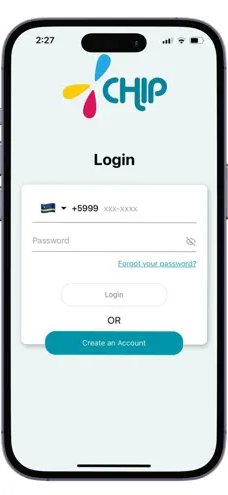
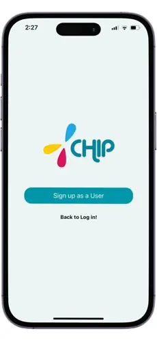
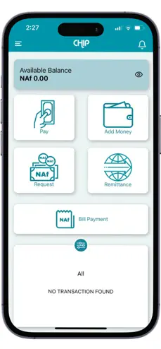
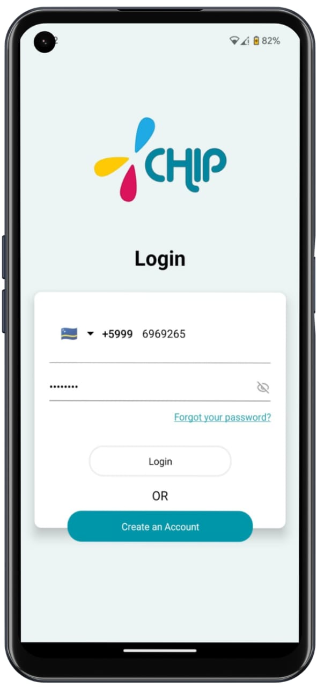
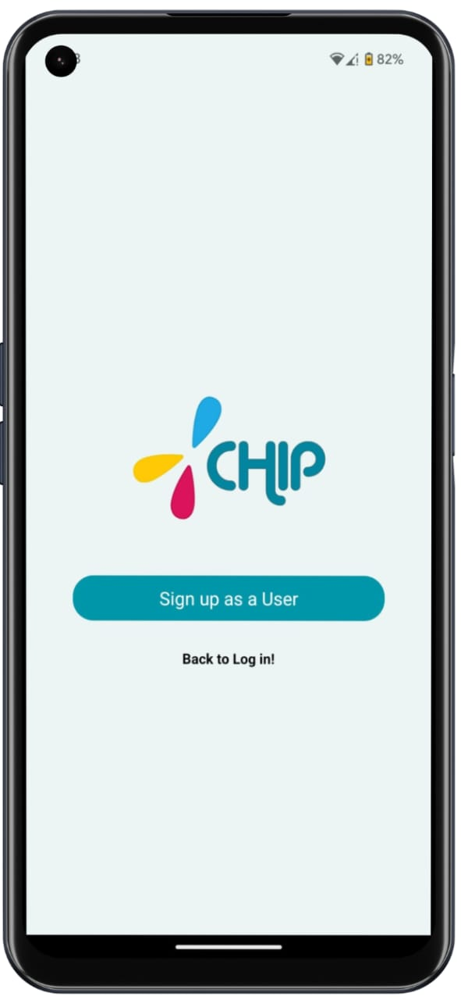
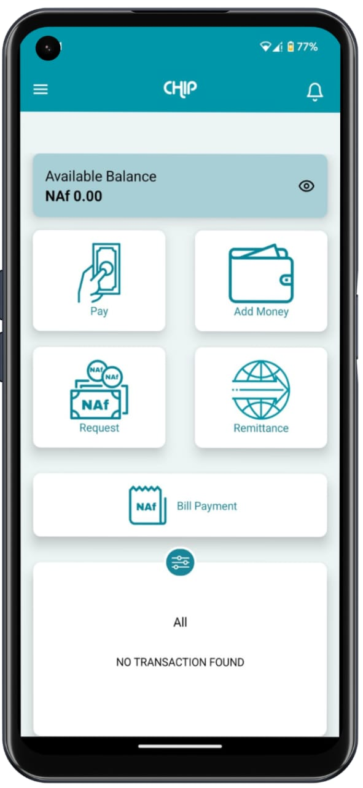

## Hi there 👋

<!-- Profile banner -->
<a href="#">
  <picture>
    
  </picture>
</a>

---

### **REACT NATIVE DEVELOPER**

_LAHORE, PAKISTAN (UTC+5)_

- E-mail: devhamzagulraiz@gmail.com
- StackOverflow: https://stackoverflow.com/users/23890926/hamza-gulraiz
- LinkedIn: https://www.linkedin.com/in/hamza-gulraiz-b1a105251/
- Web: http://covelper.com

### **About**

2 years of experience in mobile app development.

### **Tech Stack**

- **Mobile (React Native)**:

  - **Languages**: JavaScript (ES6+), TypeScript
  - **Core Libraries**: React Native, Expo, Redux, Context API, AsyncStorage, Hooks, Axios, Styled Components
  - **System Frameworks**: Navigation (React Navigation), Animation (Reanimated, Lottie), Geolocation, Permissions, Push Notifications, Linking, Clipboard, Camera, File System
  - **Libs/Frameworks**: Firebase (Authentication, Firestore, Cloud Functions, Analytics), React Native Elements, React Native Paper, React Query, NativeBase, Jest MapView (for maps), react-native-svg
  - **CI/CD**: GitHub Actions
  - **Automation**: EAS (Expo Application Services), CocoaPods (iOS)

- **Backend**: Node.js, Express, MongoDB, Firebase Realtime Database, Firestore, Google Cloud Functions, RESTful APIs

- **Additional Tools**: Xcode, Android Studio, Postman, Expo CLI, VS Code, Vercel, Github

### Projects

#### Chip – The Smart Payment Solution for Curaçao

Played a key role in developing **Chip**, an e-wallet designed to streamline financial transactions for users in Curaçao. The app allows users to manage various financial tasks like paying bills, transferring money, and shopping online with ease. As a front-end developer, I worked on both the Android and iOS versions, ensuring a smooth, user-friendly experience and successfully publishing the app on the [App Store](https://apps.apple.com/us/app/chip-wallet/id6479026465) and [Play Store](https://play.google.com/store/apps/details?id=com.chip.curacao&pli=1).

  <!-- iOS Images -->
  
  
  

  <!-- Android Images -->
  
  
  

---

#### Pendulum – Exclusive Event Management Application

Contributed to the development of **Pendulum**, a members-only event management platform that offers exclusive access to premium events in fashion, art, sports, and music across the globe. As part of the development team, I enhanced user engagement features and streamlined the event discovery process, allowing members to receive invitations to nearby events and gain early access to tickets. Pendulum grants its elite clientele privileges like guest list access, bespoke shopping experiences, and attendance at in-house curated events. Available on the [App Store](https://apps.apple.com/us/app/pendulum-members/id6476434974).
