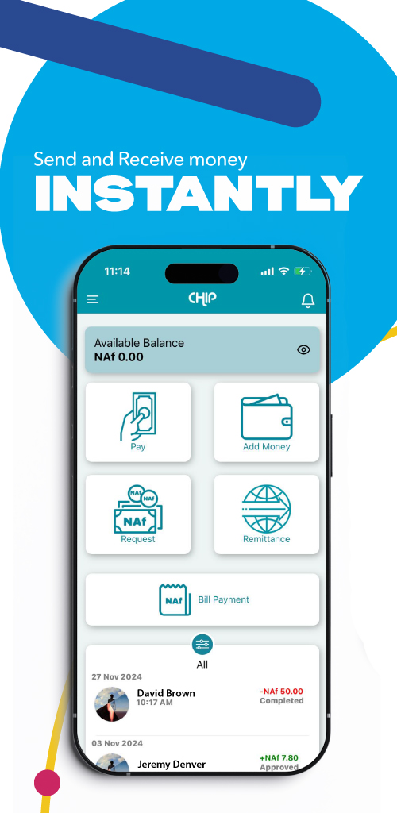
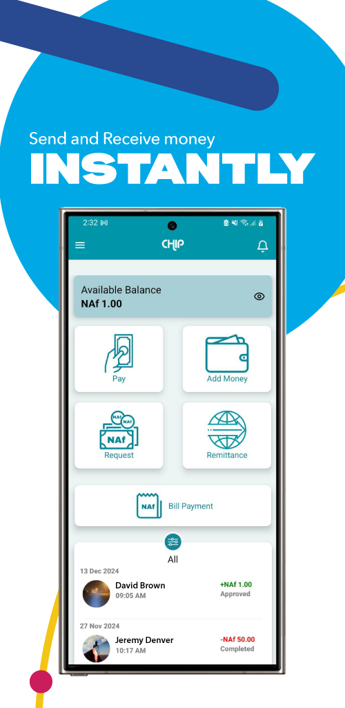
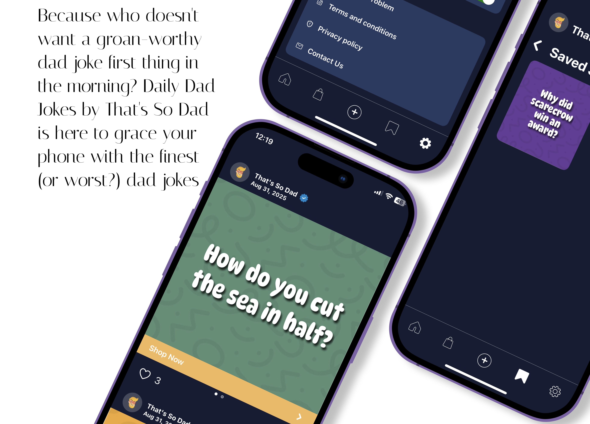

## Hi there 👋

<h1 align="start">💻 HAMZA GULRIAZ</h1>

<!-- Profile banner -->
<a href="#">
  <picture>
    
  </picture>
</a>

---

### 🚀 **REACT NATIVE DEVELOPER**

<h3 align="start">Software Engineer | MERN Stack Developer | Musician</h3>

---

👨‍💻 About Me
As a React Native developer, I’ve published production-grade apps to both the App Store and Play Store, and contributed to open-source libraries, including packages published on npm under @dev-hamza. I actively maintain my own libraries, such as custom hooks and utility tools tailored for React Native projects—aiming to support the developer community and improve mobile workflows.

My development journey includes working with native modules, animations, Firebase integrations, and building robust UI/UX experiences. I also enjoy digging deeper into React Native internals, experimenting with TurboModules, and exploring performance optimizations on both Android and iOS.

With a mindset geared toward growth, I'm always looking for opportunities to:

Collaborate on impactful projects
Contribute to open-source
Learn from other developers and communities

---

_LAHORE, PAKISTAN (UTC+5)_

  
  
  
  
  
  
  

---

### 💻 **Tech Stack**

#### 📱 Mobile (React Native / Expo)

#### 🔙 Backend

#### 🛠️ Tools & DevOps

---

### 📲 **Projects**

#### 💳 Chip – The Smart Payment Solution for Curaçao

Built and maintained **Chip**, a digital wallet app allowing seamless payments, money transfers, bill management, and more. Focused on performance and iOS/Android compatibility.
📱 [App Store](https://apps.apple.com/us/app/chip-wallet/id6479026465) | 🤖 [Play Store](https://play.google.com/store/apps/details?id=com.chip.curacao&pli=1)

  
  
  

---

#### 💳 Daily Dad Jokes by That’s So Dad

That’s So Dad hired me to take their 3-year-old “Daily Dad Jokes” app from “functional but dated” to “App-Store-featured level.” I led a full-cycle refresh: redesigned every screen, rewrote 70 % of the legacy code, and slashed Firebase costs by 86 % while keeping the daily-joke engine intact.
📱 [App Store](https://apps.apple.com/app/daily-dad-jokes-thats-so-dad/id6661013943) | 🤖 [Play Store](https://play.google.com/store/apps/details?id=com.dailyjokesfeed&hl=en)

  

---

### 📊 **GitHub Stats**

  
  

---

### 🔥 **GitHub Streaks**

  

---

### 🧠 **Profile View Counter**

  

---
